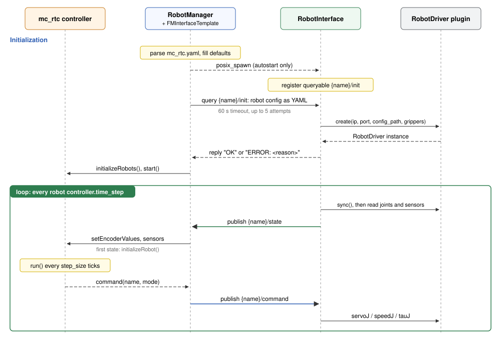

# Robot manager (`uri manager`)

`uri manager` is the process that runs mc_rtc. At startup it reads a standard
`mc_rtc.yaml` extended with a `Robots:` section and sets up one manager-side
proxy per robot. It then handshakes with every robot's interface process (`uri interface`).
Finally, it runs the real-time loop that moves state into mc_rtc and commands
out of it.

```bash
uri manager -c /path/to/mc_rtc.yaml
```

| Option / variable | Meaning |
|---|---|
| `-c, --config <file>` | mc_rtc configuration, **required** |
| `MC_RT_FREQ=<ms>` | Period of the `SCHED_DEADLINE` reservation for the main thread, in **milliseconds** (default 1) |

## Code map

| Class | File | Role |
|---|---|---|
| `robot_manager::RobotManager` | `robot_manager/src/robot_manager/RobotManager.cpp` | Config processing, autostart, init handshake, main loop |
| `robot_manager::RobotInterfaceBase` | `robot_manager/include/robot_interface/RobotInterfaceBase.h` | Abstract manager-side proxy of one robot (`updateSensors`, `updateControl`) |
| `robot_manager::FMInterfaceTemplate` | `robot_manager/src/robot_interface/FMInterfaceTemplate.cpp` | Default proxy: forwards `State` to mc_rtc and mc_rtc's output as `Command` |
| `robot_manager::RobotInterfaceFactory` | `robot_manager/src/robot_interface/RobotInterfaceFactory.cpp` | Picks the proxy implementation from the robot's `interface:` key |
| `robot_controller::Controller` | `robot_controller/include/robot_controller/Controller.h` | Abstract controller backend; `ControllerMcRtc` wraps `MCGlobalController` |

## Configuration reference

`uri` takes a normal mc_rtc configuration: `MainRobot`, `Enabled`,
`Timestep`, observers and so on still mean what they do in mc_rtc. On top of
that, it reads the keys below.

```yaml
MainRobot: UR5e
Enabled: Posture
Timestep: 0.005              # mc_rtc period, shared by all robots

Controller: mc_rtc           # [optional] controller backend, default mc_rtc

Robots:
  ur5e:                                  # robot name = topic prefix
    module: UR5e                         # mc_rtc RobotModule name
    interface: interface_template        # [optional] manager-side proxy
    base: other_robot                    # [optional] inherit another entry
    controller:
      mode: position                     # position | velocity | torque
      time_step: 0.001                   # [optional] robot interface period [s], default Timestep
    network_interface:                   # see Communication
      protocol: zenoh
    robot_interface:                     # forwarded to the uri interface
      driver: RobotDriverRTDE            # plugin class name
      ip: 192.168.1.6
      port: 0
      config_path: /path/to/driver.yaml  # [optional] driver-specific file
      autostart: false                   # [optional] spawn uri interface locally
```

### `Robots.<name>` keys

| Key | Required | Default | Meaning |
|---|---|---|---|
| `module` | **yes** | none | mc_rtc RobotModule. It also provides the gripper list sent to the driver. |
| `interface` | no | `interface_template` | Manager-side proxy implementation (`RobotInterfaceFactory`) |
| `base` | no | none | Copy another robot's entry, then apply this entry's keys on top |
| `controller.mode` | no | `position` | Command type sent to the robot |
| `controller.time_step` | no | `Timestep` | Robot interface control period in seconds. Can differ between robots. |
| `network_interface.protocol` | no | `zenoh/shm` | See [Communication](docCommunication.html) |
| `robot_interface.driver` | **yes** | none | Driver plugin class, e.g. `RobotDriverRTDE` |
| `robot_interface.ip` | **yes** | none | Passed to the driver's `create()`. Required even for drivers that ignore it. |
| `robot_interface.port` | **yes** | none | Same as `ip` |
| `robot_interface.config_path` | no | `""` | Passed to the driver's `create()` for driver-specific settings |
| `robot_interface.autostart` | no | `false` | `uri manager` spawns and stops the robot's `uri interface` itself |

### Timing rules

For every robot, `uri` checks the timing at startup and refuses to start if a
rule is broken:

- `Timestep` ≥ `controller.time_step`: mc_rtc cannot run faster than the
  robot.
- `Timestep` is an exact multiple of `controller.time_step`.

The main loop ticks at the robot period and calls mc_rtc's `run()` every
`Timestep / time_step` ticks. For example, `Timestep: 0.005` with
`time_step: 0.001` gives a 1 kHz loop and mc_rtc at 200 Hz. Between mc_rtc
runs, the last command is sent again.

> The main loop period is taken from the **first** robot. With several robots,
> give them the same `time_step`.

## Startup sequence



1. **Config processing** (`processGConfig`) fills in the few defaults, resolves
   `base:`, validates required keys and picks the protocol.
2. **Controller**: `ControllerLoader` loads the backend named by `Controller:`
   from `<libdir>/robot_controller/librobot_controller_<backend>.so`.
3. **Per robot** (`init`):
   - Start a local Zenoh router if any robot uses Zenoh.
   - Read the grippers from the RobotModule and add them to the robot's
     config as `grippers: {name: [joints]}`.
   - With `autostart: true`, write `/tmp/robot_manager_<name>_interface.yaml`
     and `posix_spawn` `uri interface -c <that file> -n <name>`, using the same
     `uri` executable as the manager (`/proc/self/exe`), or `uri` on `PATH` as a
     fallback. The exact command is printed, so it can be rerun by hand with
     `autostart: false`.
   - Create the proxy (`FMInterfaceTemplate`) with a `robot_comm` server.
4. **Init handshake**: for each robot, send the robot's whole config on
   `{name}/init` and wait up to 60 s per attempt, retrying up to 5 times.
   Robots that time out or reply `ERROR: ...` are **dropped** with an error
   message, and the others continue. If no robot answers, `uri` stops.
5. **Timing checks** (above), then `initializeRobots()` and `start()` on the
   controller.
6. **Main loop** (`mainThread`), every robot period:
   1. `updateSensors()` on every proxy. The first `State` received from a
      robot initializes the mc_rtc robot at its real joint positions.
   2. Once every robot has been initialized, call `controller.run()` every
      `step_size` ticks. Until then, no command is computed, so the robot
      never jumps toward a default posture.
   3. `updateControl()` on every proxy publishes a `Command` in the robot's
      `controller.mode`.

On `Ctrl+C`, the controller stops, the threads are joined and spawned
`uri interface` processes receive `SIGTERM`, then `SIGKILL` after 5 s.

## Controller backend

`uri` talks to mc_rtc only through `robot_controller::Controller`, loaded as a
plugin, so another control framework could be plugged in. A backend is a
shared library named `librobot_controller_<name>.so`, installed in
`<libdir>/robot_controller/`. It exports three C symbols:

```cpp
extern "C" {
const char * robot_controller_backend_name();                   // must return "<name>"
robot_controller::Controller * robot_controller_create(const char * config_yaml);
void robot_controller_destroy(robot_controller::Controller *);
}
```

Select it with `Controller: <name>` in `mc_rtc.yaml`. See
`robot_controller/src/mc_rtc/ControllerMcRtc.cpp` for the reference
implementation.

## Custom manager-side proxy

`FMInterfaceTemplate` covers the standard case: joint state and sensors in,
one command type out. If a robot needs different manager-side behavior, such
as a different data mapping or extra logic before commands are sent,
subclass `robot_manager::RobotInterfaceBase`:

```cpp
class MyInterface : public robot_manager::RobotInterfaceBase
{
public:
  MyInterface(const std::string & name, const mc_rtc::Configuration & config, uint8_t buffer_size)
  : RobotInterfaceBase(name, config, buffer_size)
  {
    auto comm = robot_comm::CommunicationFactory::makeCommunication(name, config("network_interface"));
    comm->setupServer();
    setCommunication(std::move(comm));
  }

  void init() override {}
  void reset() override {}
  void stop() override {}

  void updateSensors(robot_controller::Controller & gc) override { /* receive State, gc.setEncoderValues(...) */ }
  void updateControl(robot_controller::Controller & gc) override { /* gc.command(...), send Command */ }
  bool isInitialized() const override { /* true once gc.initializeRobot() was called */ }
};
```

Then register it under a new name in `RobotInterfaceFactory::makeInterface`,
and select it with `interface: <name>` on the robot.

## Troubleshooting

### Segmentation fault on Ctrl-C with CycloneDDS

Symptom: `uri manager` shuts down normally, then crashes:

```text
^C[warning] Caught signal 2
RobotManager shutdown complete.
[info] [ZenohTransport] Stopped
segmentation fault (core dumped)  uri manager --config ...
```

The crash does not happen under gdb. It goes away when `RMW_IMPLEMENTATION`
is unset.

Cause: mc_rtc's ROS support loads the ROS middleware named by
`RMW_IMPLEMENTATION`. ROS Humble's `rmw_cyclonedds_cpp` is built against the
CycloneDDS shipped with ROS (0.10.5, in `/opt/ros/humble/lib/x86_64-linux-gnu`).
If another CycloneDDS is installed system-wide (for example 0.10.2 in
`/usr/local/lib`, installed by the Unitree SDK), `uri` may load that one
instead. The two versions are not ABI compatible, and the process crashes when
DDS is torn down at exit.

`LD_LIBRARY_PATH` does not help. `uri` has the `cap_sys_nice` file capability
(see [Getting started](docGettingStarted.html)), so the dynamic loader ignores
`LD_LIBRARY_PATH` and takes libraries from `ld.so.cache`, where `/usr/local/lib`
comes first. gdb drops the capability, so under gdb the library path is
resolved differently. That is why the crash does not show up there.

To check which CycloneDDS is loaded, look at the maps of a running manager:

```sh
grep ddsc /proc/$(pgrep -f "uri manager")/maps
```

Fixes, from simplest to cleanest:

1. Use Fast DDS for the manager: unset `RMW_IMPLEMENTATION`, or set it to
   `rmw_fastrtps_cpp`.
2. Take the other CycloneDDS out of the system-wide path. For example, move
   `/usr/local/lib/libddsc*` and `/usr/local/lib/libddscxx*` to a private
   prefix, run `sudo ldconfig`, and point the software that needs them there
   with RPATH or `LD_LIBRARY_PATH`. `ldconfig -p | grep libddsc` lists every
   copy the loader can find.

## Known limitations

- The Zenoh router config path in `RobotManager::launchZenohRouter()` is
  hard-coded. Adjust it for your machine.
- The robot proxy's `controlThread()` is currently a no-op. All robots are
  served by the single main loop.
- Init waits a fixed 500 ms after spawning before querying. The retry loop
  covers slower starts.

---

[](https://unit.aist.go.jp/isri/isri-jrl/en/)[](https://www.cnrs.fr/)[](https://www.aist.go.jp/index_en.html)

Copyright © CNRS-AIST JRL 2026
