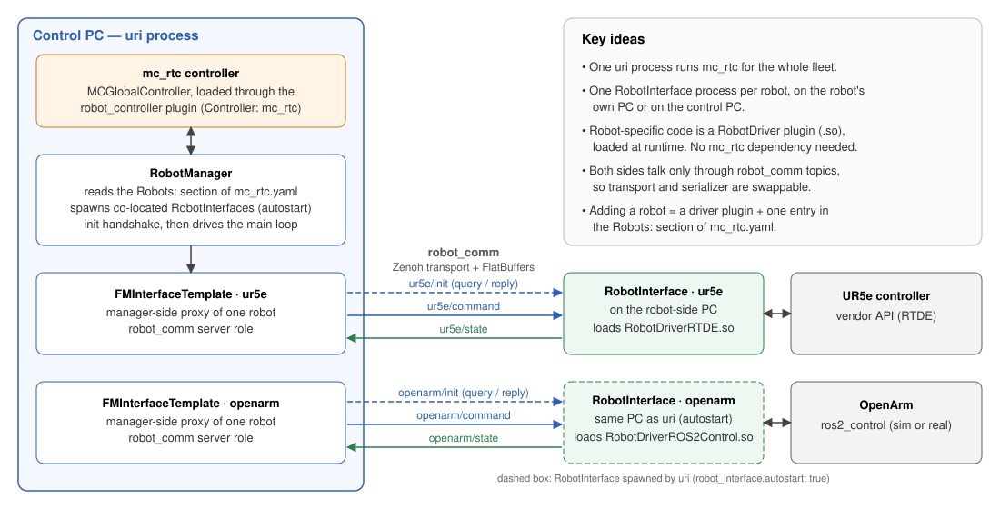

# Unified Robot Interface (URI)

URI runs one [mc_rtc](https://jrl-umi3218.github.io/mc_rtc/) controller over a
fleet of heterogeneous robots. It also standardises how a new robot is
connected to that controller.

## Context

mc_rtc is a real-time, QP-based control framework. Usually, running mc_rtc on
a robot means writing a dedicated *interface* binary for that robot. The
binary embeds `mc_control::MCGlobalController`, talks to the robot's SDK and
runs the control loop. Each new robot needs another such binary, and
controlling several robots from one controller is not supported out of the
box.

URI splits that monolithic interface into three parts:

- **`uri manager`, the robot manager**: a single process on the control PC that runs
  mc_rtc for the whole fleet. It reads the `Robots:` section of `mc_rtc.yaml`
  and feeds every robot's state into mc_rtc. It then sends mc_rtc's commands
  back to each robot.
- **`uri interface`**: one generic process per robot. It runs either on the
  robot's own PC or on the control PC. It knows nothing about a particular
  robot: at startup it loads a **`RobotDriver` plugin** (a shared library)
  that wraps the robot's SDK.
- **`robot_comm`**: the communication layer between the two. It currently uses
  Zenoh for transport and FlatBuffers for serialization. Neither side depends
  on how bytes travel.

As a result:

- **Adding a robot** means writing a small `RobotDriver` plugin (about eight
  methods, no mc_rtc dependency) and adding one entry to `mc_rtc.yaml`. See
  [Create a new robot driver](docNewRobotDriver.html).
- **Robots can be distributed.** A robot connected to another PC runs its own
  `uri interface` there. A robot plugged into the control PC is started
  automatically by `uri manager` (`robot_interface.autostart: true`) and uses Zenoh
  shared memory.
- **Robots with different rates share one controller.** Each robot keeps its
  own control period. mc_rtc runs at a multiple of it.

## Components

| Directory | Library / binary | Role | Page |
|---|---|---|---|
| `robot_comm/` | `robot_comm` | Transport and serializer abstraction, message types, pub/sub and query/reply | [Communication](docCommunication.html) |
| `robot_manager/` | `uri`, `robot_manager`, `robot_interface` | Fleet orchestrator: config parsing, init handshake, main loop, manager-side robot proxies | [Robot manager](docRobotManager.html) |
| `robot_interface/` | `RobotInterface` (`uri interface`), `robot_driver_api`, `robot_driver_loader`, state viewer (`uri viewer`) | Robot-side process, the `RobotDriver` plugin API and its loader | [Robot interface](docRobotInterface.html) |
| `robot_controller/` | `robot_controller_mc_rtc` | Controller backend abstraction; mc_rtc is the only current backend | [Robot manager](docRobotManager.html) |

## Where to go next

1. [Getting started](docGettingStarted.html): build the project, run the
   examples and generate this documentation.
2. [Command line](docCommandLine.html): the `uri` commands and their options.
3. [Communication](docCommunication.html): topics, messages, serializers and
   how to use `robot_comm` on its own.
4. [Robot manager](docRobotManager.html): `mc_rtc.yaml` reference, the init
   handshake and the real-time loop.
5. [Robot interface](docRobotInterface.html): the robot-side process, its
   control loop and how drivers are loaded.
6. [Supported robots](docSupportedRobots.html): the existing driver plugins
   and how to install them.
7. [Create a new robot driver](docNewRobotDriver.html): scaffold, implement,
   build and test a driver for a new robot.
8. [Simulation](docSimulation.html): simulate robots with ros2_control, or
   write a simulation driver.

The API reference (classes, functions, namespaces) is in the sidebar. It is
generated from the source code.

---

Copyright © CNRS-AIST JRL 2026
